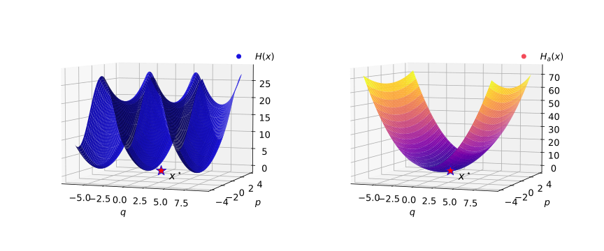

# Total Energy Shaping with Neural Interconnection and Damping Assignment - Passivity Based Control (IDA-PBC)
This repository contains the implementation of the methodology described in:

Santiago Sanchez-Escalonilla et al., [Total Energy Shaping with Neural Interconnection and Damping Assignment - Passivity Based Control](https://arxiv.org/abs/2112.12999), Accepted in 4th Annual Learning for Dynamics and Control Conference, July 2022

## What is energy shaping?
Energy shaping allows to exploit the real dynamics of complex systems.

The energy function, $H(x)$ (**left**), of the simple pendulum shows multiple equilibria. IDA-PBC's main objective is to shape the closed loop energy, $H_d(x)$ (**right**), such that the closed loop dynamics are stable around a desired point $x^\star$.

## How to use this repository
This repository contains two working examples of mechanical systems:
1. Simple pendulum
2. Double pendulum

To test the methodology you can direct to the main file of either one of the examples. This main file can be used for either training or simulating the time response.

## Requirements
This repository runs on Python 3.9, tensorflow 2.6, numpy 1.19.5 and matplotlib 3.4.3.